<div align="center">

  

  **AI-directed video editing.** Describe your idea in a single sentence and get a 30-45 second edited video. The system handles narrative, shots, pacing, motion, subtitles, voice, and images,no templates, no manual config. Images are optional: we fetch from the web (Unsplash / DALL·E / Pexels) from your description, or use a placeholder if APIs fail.

  **Tech stack**

  <a href="https://nextjs.org/" title="Next.js"></a>
  <a href="https://www.typescriptlang.org/" title="TypeScript"></a>
  <a href="https://react.dev/" title="React"></a>
  <a href="https://www.remotion.dev/" title="Remotion"></a>
  <a href="https://docs.bullmq.io/" title="BullMQ"></a>
  <a href="https://redis.io/" title="Redis"></a>
  <a href="https://openrouter.ai/" title="OpenRouter"></a>
  <a href="https://elevenlabs.io/" title="ElevenLabs"></a>
  <a href="https://play.ht/" title="PlayHT"></a>
  <a href="https://tailwindcss.com/" title="Tailwind CSS"></a>

  Next.js · TypeScript · React 19 · Remotion · BullMQ · Redis · OpenRouter · ElevenLabs / PlayHT · Tailwind CSS

  [](https://nextjs.org/)
  [](https://www.typescriptlang.org/)
  [](https://www.remotion.dev/)
  [](https://docs.bullmq.io/)
  [](https://redis.io/)
  [](https://openrouter.ai/)
  [](https://tailwindcss.com/)

</div>

---

## Overview

Creating short-form video today means writing scripts, picking templates, sourcing B-roll, and editing by hand. By the time you’re done, the idea has aged and the format feels generic.

CUTLINE adds an **AI director layer**. You give one sentence of intent (e.g. “Explain why coffee makes you feel awake in 30 seconds”). The system infers audience, goal, and tone; plans a narrative arc; breaks it into shots; writes the script; generates voice and subtitles; sources or generates images; and composes a finished MP4. No templates, no storyboards, every video is directed from intent. Optional asset uploads (logo, product photos, brand colors) enrich the pipeline; the system still owns all creative decisions.

---

## Core Capabilities:

---

### Intent Interpretation

The pipeline starts by parsing your single sentence into a structured intent: **audience**, **goal**, **tone**, **complexity**, and **duration**. Ambiguity is resolved by the system. This representation drives every downstream stage.

**Test:** `POST /api/intent` with `{ "input": "Explain why coffee makes you feel awake in 30 seconds" }` → `{ audience, goal, tone, complexity, durationSeconds, rawInput }`.

---

### Narrative Planning

From the intent, the system produces a **narrative plan**: arc, 3-5 beats, pacing. No user-facing storyboard, this is an internal representation that drives shot and script decisions.

---

### Shot-Level Reasoning

For each narrative beat, the system decides: what the shot represents (concept, example, transition), how long it holds, and how it relates to adjacent shots. Shot-level reasoning respects pacing (faster cuts for energy, longer holds for explanation) and maintains continuity. No templates; each shot is chosen for this video.

---

### Script and Subtitles

The system generates **spoken copy** aligned to shot boundaries. Script is passed to TTS (ElevenLabs or PlayHT) and to the subtitle stage. Subtitles are chunked and timed; when TTS returns **word-level timings**, the pipeline refines the subtitle track so chunks align to actual spoken words, subtitles appear and disappear in sync with the voice.

**Refinement:** `POST /api/subtitles/refine` with `{ subtitleTrack, wordTimings?, script, shotList }` returns the refined track. **Rendering:** Captions flow from `generateSubtitles` → `refineSubtitles` → `getCaptionsRenderOption` → `renderInput` → `buildRemotionProps` → Remotion props → `CUTLINEComposition` → `SubtitleOverlay` (time in ms, global timeline; `useCurrentFrame()` is composition frame).

---

### Motion and Visuals

**Motion** specifies how each shot is composed and animated (scale, pan, zoom). **Visuals** specify colors and layout from intent and optional analyzed assets. Both are computed in-process from the shot list and intent; no user config.

---

### Image Sourcing

Every shot gets an image (URL or path). The pipeline derives a search query or image prompt per shot from intent and script (via OpenRouter). It then tries: **Unsplash** (primary) → **DALL·E 3** (AI fallback) → **Pexels** (alternate stock) → simplified query retry. If all fail, a **placeholder** is used so the video still generates.

**Optional:** User-uploaded product photos can be assigned to shots by matching shot purpose to analyzed suggested shot types.

**Test:** `POST /api/images/source` with `{ intent, shotList, script, analyzedAssets?, assetPaths? }` → `ImageSpec` (per-shot `shotId`, `imageUrl`, `source`, `fallbackUsed`).

---

### Optional Asset Upload and Analysis

You can upload **logo**, **product photos**, **reference video/images**, and **brand colors** (hex). Assets are stored; IDs and brand colors are passed into the job. When present, the pipeline runs **asset analysis** (OpenRouter vision) before the visual stage:

- **Logo:** Dominant colors, aspect ratio, transparency, suggested placement (`outro` | `watermark` | `hero`).
- **Product photos:** Dominant colors, aspect ratio, subject description, suggested shot types.
- **Reference video:** Keyframes extracted (ffmpeg); vision analyzes color palette; optional cuts-per-minute.
- **Reference images:** Color palette, mood/style description.
- **Brand colors:** Pass-through (hex validated).

Analysis output is passed to the visual layer and image sourcing. Logo placement is applied in the Remotion composition (watermark, outro, hero).

**Test:** `POST /api/assets/analyze` with `{ assetIds, brandColors? }` → `AnalyzedAssets`.

---

### Video Rendering

The final stage takes the locked narrative plan, shot list, script, subtitles, motion spec, visual spec, **image spec**, and TTS audio and produces a single MP4 via **Remotion**. Output is written to `public/temp/[jobId].mp4` and served at `/temp/[jobId].mp4`. Cleanup runs automatically (configurable retention).

---

### Async Job Queue

Video generation runs in the background so the UI doesn’t block. **Redis is required.**

1. **Submit:** User enters one sentence (and optional assets) on `/generate` → **POST /api/generate** creates a BullMQ job, returns `jobId`.
2. **Worker:** A separate process (`npm run worker`) picks up the job and runs the full pipeline (Intent → Narrative → Shots → Script → Subtitles → TTS → Subtitle refine → Motion → Asset analysis → Visuals → Image sourcing → Remotion render).
3. **Poll:** UI calls **GET /api/generate/[jobId]** until `status` is `completed`, `failed`, or `cancelled`; then shows video or error. The generate flow uses exponential backoff for status polling (2s → 4s → 8s → 15s capped → …) to reduce API load; polling stops after 30 minutes with a user message.

Rendered videos are written to `public/temp/[jobId].mp4`. Cleanup (repeatable BullMQ job when worker is running) deletes old temp videos, uploads, and per-job images.

**Download and share:** When a job completes, the generate flow shows a **Download** button that uses `GET /api/generate/[jobId]/download` (with optional `?variant=N` for multi-variant jobs). The endpoint streams the file with `Content-Disposition: attachment` so browsers save it (e.g. `cutline-[jobId].mp4`). A **Copy link** button copies the full video URL to the clipboard for sharing. For jobs with multiple variations, Download and Copy link apply to the currently selected variant.

---

### Job cancellation

You can cancel a pending or running job. Cancellation is **best-effort**: if the pipeline is mid-stage (e.g. LLM or render call), it finishes that step before exiting. The pipeline checks a cancelled flag between stages.

- **POST /api/generate/[jobId]/cancel**: Cancel the job. Returns `200 { cancelled: true, jobId }` if cancelled; `409 { error, reason }` if already completed/failed; `404` if job not found.
- **Source of truth:** Redis SET `cutline:job:cancelled`; worker and API both read/write this.
- **Cleanup:** When cancelled, the pipeline runs the same temp-artifact cleanup as on failure (`cleanupJobArtifacts`).
- **Effect delay:** Cancellation may take up to one stage duration to take effect (checks are between stages only).

**Edge cases:** Cancel twice → second call returns 409. Job not found → 404. Pending job cancelled before worker starts → worker picks up, checks status, skips pipeline and cleans up.

In production you may want to restrict who can cancel (e.g. same client that started the job).

---

### List recent jobs

**GET /api/generate/jobs** (and **GET /api/v1/generate/jobs**) returns a list of recent video generation jobs so clients can show "Your recent generations" or resume polling. The list is global (all jobs in the queue); no auth or user identity in this version.

- **Query param:** `limit` (optional). Default **20**, max **50**. Invalid values (e.g. negative or &gt; 50) return **400** with code `BAD_REQUEST`.
- **Response:** `{ jobs: [{ jobId, status, createdAt, videoUrl?, topic?, error? }] }`
  - **jobId** (string): Job ID.
  - **status** (string): `pending` | `processing` | `completed` | `failed` | `cancelled`.
  - **createdAt** (string): ISO 8601 timestamp when the job was created.
  - **videoUrl** (string, optional): Present when status is `completed` (primary video URL).
  - **topic** (string, optional): Input/topic from the job (e.g. the one-sentence prompt).
  - **error** (string, optional): Present when status is `failed` (failure reason).
- **Store empty:** Returns `{ jobs: [] }`.
- Jobs removed by retention (e.g. `deleteStaleJobs`) are not in the list; only jobs still in the queue are returned.

The generate page includes an optional **Recent generations** collapsible section that fetches this endpoint and lets users open a job (View/Watch) to resume polling or watch the result.

---

### CORS

The generate API (POST /api/generate, GET /api/generate/[jobId], POST cancel, GET download) supports cross-origin requests so it can be called from another domain or port. CORS is **configurable via environment** and applied **only to these routes**; admin and telemetry routes are not included (same-origin or protect separately).

- **Config:** Set `CORS_ORIGIN` (single value) or `CORS_ORIGINS` (comma-separated). Examples: `CORS_ORIGIN=https://app.example.com`, `CORS_ORIGINS=https://app.example.com,https://admin.example.com`. For local dev: `CORS_ORIGIN=http://localhost:3000` or `CORS_ORIGIN=*`. If **unset or empty**, no `Access-Control-*` headers are sent (same-origin only).
- **Preflight:** OPTIONS requests to the same paths return 204 with `Allow` and CORS headers so browsers can complete preflight before POST/GET.
- **No Origin header** (e.g. same-origin or curl): no CORS headers are set; the response is readable by the caller.
- **Origin not in list:** we do not set `Access-Control-Allow-Origin`; the browser will block the response for that cross-origin request. Use `*` only in development if at all.

CORS is implemented per-route (not middleware) so admin/telemetry stay excluded.

---

### Idempotency

**POST /api/generate** accepts an optional **X-Idempotency-Key** header. If the client sends the same key again within a retention window (default 24 hours), the API returns the **same job ID** and response as the first request instead of creating a new job. This allows safe retries after network errors or timeouts.

- **Header:** `X-Idempotency-Key` (case-insensitive). Any string up to **128 characters**; longer keys are rejected with 400 and message "Idempotency key too long".
- **Matching:** Key-only. The same key within the retention window returns the original `{ jobId }`; request body is not hashed or compared. Two requests with the same key and different bodies will still return the first job’s ID (client should use one key per logical "create" attempt).
- **Storage:** In-memory only. Keys and their stored results are **lost on server restart**. After a restart, the same key is treated as a new request and may create a new job.
- **Retention:** Stored keys are removed after **IDEMPOTENCY_RETENTION_HOURS** (default 24, max 168). Expired entries are evicted when reading or when adding; keys older than retention are treated as new.
- **Concurrent same key:** A per-key lock ensures only one job is created; concurrent requests with the same key serialize and the second receives the same `{ jobId }` from the store.
- **Job later fails or is cancelled:** The stored response is the initial `{ jobId }`. Retries with the same key still get that job ID; the client can poll GET /api/generate/[jobId] for current status. The store is not updated when the job completes or fails.

---

### Webhook

When starting a job, you can optionally pass `callbackUrl` in **POST /api/generate**. When the job reaches a terminal state (completed, failed, or cancelled), the server sends a **POST** request to that URL with a JSON body. Best-effort, fire-and-forget; no retries, no auth/signing.

**Payload shape:** `{ jobId, status, videoUrl?, variations?, completedAt, error? }`
- `jobId` (string): Job ID
- `status`: `"completed"` | `"failed"` | `"cancelled"`
- `videoUrl` (string, optional): When completed, the primary video URL (e.g. `/temp/[jobId].mp4`)
- `variations` (array, optional): When completed with multiple variants: `[{ videoUrl }, ...]`
- `completedAt` (string): ISO timestamp when the job reached terminal state
- `error` (string, optional): When failed/cancelled, the error message

**Validation:** Only `http://` and `https://` URLs are allowed. Localhost is rejected in production; set `ALLOW_LOCALHOST_WEBHOOK=true` for development.

**Edge cases:** If `callbackUrl` is not set, no webhook is sent. If the callback returns 4xx/5xx or times out (5s), the failure is logged and ignored—no retry.

---

### Job retention

Jobs in terminal state (completed, failed, cancelled) are kept in the BullMQ/Redis store. To prevent unbounded growth, set **JOB_RETENTION_DAYS** (e.g. 7). When the worker runs, it periodically removes jobs older than that. Run: once at startup (setImmediate) and every 24 hours.

- **JOB_RETENTION_DAYS**: Remove completed/failed jobs older than N days. Set to 0 or leave unset to disable cleanup.
- Only terminal-state jobs are removed; pending and running jobs are never deleted.
- Video files and temp outputs are cleaned separately (VIDEO_RETENTION_HOURS, runCleanup); this only removes job metadata from Redis.

---

### Video duration (10-60 seconds)

You can choose a video length between 10 and 60 seconds on the main page. The value is sent as `durationSeconds` in **POST /api/generate** and used for both **Slideshow** and **Talking object** modes. For **Talking object**, videos longer than 8 seconds are built by generating multiple Veo clips (~8s each) and concatenating them. That concatenation step requires **ffmpeg** (on PATH or set `FFMPEG_PATH` in `.env.local`). If ffmpeg is not available and you request a talking_object video over 8 seconds, the job will fail with a clear message.

**Global max duration:** A configurable cap **MAX_VIDEO_DURATION_SECONDS** (default 300, max 3600) is enforced. Requests with `durationSeconds` above this value are rejected at validation with a clear error (e.g. "Duration cannot exceed 300 seconds."). The pipeline also caps duration to this value so that even unvalidated input cannot exceed it; when capping, a log line is emitted. Platform-specific limits (e.g. YouTube Shorts 60s) are separate; when a platform is set, the effective max is the lower of the platform limit and this global max.

**Output size limit (optional):** If **MAX_VIDEO_OUTPUT_MB** is set, after the final video file is written the pipeline checks its size. If it exceeds the limit (in MB), the job **fails** with a clear error ("Output video exceeds maximum size (N MB).") and normal failure cleanup runs. Each output is checked (including each variation), so no variant can exceed the limit. If not set, no size check is performed.

---

### Telemetry

Job and stage timings are recorded in memory for admin visibility. The telemetry store keeps up to 500 recent jobs; older entries are evicted by `startedAt`. Data resets when the server restarts unless **file persistence** is enabled: set `TELEMETRY_FILE` or `TELEMETRY_PERSIST_PATH` (e.g. `.data/telemetry.json`). When set, telemetry is loaded from the file on first use and saved after each job completes; the file is capped to the last 500 jobs. Single-process only multi-instance deployments that share the file will overwrite each other.

- **GET /api/telemetry**: List recent jobs (query param `?limit=50`, max 500)
- **GET /api/telemetry/[jobId]**: Single job with stage timings
- **GET /api/telemetry/stats**: Aggregate stats (totalJobs, completed, failed, avgDurationMs)

An admin page at **/admin** shows a table of jobs with status, duration, and expandable stage timings. **Admin auth is required:** set `ADMIN_SECRET` (or `ADMIN_API_SECRET`) in your environment. Without it, all admin/telemetry routes return 401 and the admin page shows "Admin not configured." Login uses a cookie-based session (POST /api/admin/auth with `{ secret }`); logout clears the cookie (GET /api/admin/logout).

---

### Platform-aware generation

You can target a specific platform (**General**, **LinkedIn**, **Twitter**, **YouTube Shorts**) when generating a video. The platform influences intent, narrative, shots, and script so output is tuned for that channel (length, tone, hooks, pacing). Send `platform` in **POST /api/generate** as one of `"general"`, `"linkedin"`, `"twitter"`, or `"youtube_shorts"`. **General** is the default and preserves previous behavior when platform is omitted. All platform-specific logic lives in `src/lib/platform/platformStrategy.ts`; the pipeline stages read from it and append prompt snippets accordingly.

---

## Architecture

```
+-------------------------------------------------------------------+
|  PRESENTATION                                                     |
|  Next.js 16 · React 19 · Tailwind CSS · /generate · /test         |
+-------------------------------------------------------------------+
                                    |
+-------------------------------------------------------------------+
|  APPLICATION                                                      |
|  API Routes · Rate limiting · Validation · Asset upload           |
+-------------------------------------------------------------------+
                                    |
+-------------------------------------------------------------------+
|  PIPELINE (worker process)                                        |
|  Intent → Narrative → Shots → Script → Subtitles → TTS            |
|  → Subtitle refine → Motion → Asset analysis → Visuals            |
|  → Image sourcing → Remotion render → MP4                         |
+-------------------------------------------------------------------+
                                    |
+---------------------------------------------------------------------+
|  SERVICES                                                           |
|  +------------------+  +------------------+  +------------------+   |
|  | AI (OpenRouter)  |  | TTS              |  | Images           |   |
|  | Intent, Narrative|  | ElevenLabs       |  | Unsplash, Pexels |   |
|  | Shots, Script    |  | PlayHT           |  | DALL·E 3         |   |
|  +------------------+  +------------------+  +------------------+   |
|  BullMQ (Redis) · Remotion · Local / S3 storage                     |
+---------------------------------------------------------------------+
```

**Pipeline flow (worker):**

```
Input (one sentence + optional assetIds, brandColors)
    ↓
1. Intent        - LLM: audience, goal, tone, complexity, duration
    ↓
2. Narrative     - LLM: arc, 3–5 beats, pacing
    ↓
3. Shots         - LLM: 8–12 shots, purpose, motion, text density
    ↓
4. Script        - LLM: spoken text (or silence) per shot
    ↓
5. Subtitles     - In-process: chunk script, estimate timing
    ↓
6. TTS           - ElevenLabs/PlayHT: audio per segment, silence where text is null
    ↓
7. Subtitle refine - Word timings from TTS → align subtitle chunks
    ↓
8. Motion        - In-process: motion spec per shot
    ↓
9. Asset analysis - If uploads: LLM vision on logo, product photos, ref video/images
    ↓
10. Visuals      - In-process: visual spec from intent + assets
    ↓
11. Image sourcing - Per shot: LLM query → Unsplash → DALL·E → Pexels → placeholder
    ↓
12. Remotion render - Compose script, shots, subtitles, motion, images, audio → MP4
    ↓
Output: public/temp/[jobId].mp4
```

---

## Technology Decisions

| Component         | Choice                        | Rationale                                                                                                           |
| ----------------- | ----------------------------- | ------------------------------------------------------------------------------------------------------------------- |
| Framework         | Next.js 16                    | App Router, API routes, Vercel-ready; no server-side render of video                                                |
| Language          | TypeScript 5                  | Type safety, clear contracts for pipeline stages and API                                                            |
| Video composition | Remotion 4                    | Programmatic video from React; same stack as app; deterministic render                                              |
| Job queue         | BullMQ + Redis                | Reliable async jobs; repeatable cleanup; same Redis for rate limiting                                               |
| AI                | OpenRouter                    | Single API for multiple models (Gemini, Claude, GPT); intent, narrative, shots, script, image query, asset analysis |
| TTS               | ElevenLabs / PlayHT           | High-quality voice; PCM (ElevenLabs) for silence stitching; configurable                                            |
| Images            | Unsplash, Pexels, DALL·E 3    | Stock first, AI fallback; placeholder if all fail so video still completes                                          |
| Storage           | Local / S3                    | Uploads and temp files; no DB for pipeline state—job state in Redis/BullMQ                                          |
| Rate limiting     | Redis + rate-limiter-flexible | Per-IP limits on generate, upload, status; abuse protection                                                         |
| Testing           | Vitest                        | Unit tests next to source; integration test for POST /api/generate + poll                                           |

---

## Design Philosophy

**One sentence in, video out.** The user provides no script, no storyboard, and no creative knobs at MVP. The system behaves like a director and an editor: it infers intent, plans narrative, chooses shots, writes copy, and sources visuals. That keeps the product simple and the scope bounded.

**No templates.** Every video is directed from intent. Shot list, script, and motion are generated per request, not selected from a library. Repeatability (same intent → same output) is a goal where feasible; randomness in asset selection is minimized or seedable.

**Pipeline over monolith.** The video pipeline is a linear sequence of stages. Each stage consumes the previous output; failures throw and the job is marked failed. Retries (with backoff) apply to transient failures (LLM, TTS, image fetch, Remotion). Clear stage boundaries make it easy to test (e.g. `POST /api/intent`, `POST /api/images/source`) and to swap implementations later.

**Worker separate from app.** Rendering is long-running and CPU-heavy. The Next.js app enqueues jobs and serves the UI; a separate worker process runs the pipeline and writes MP4s. That keeps Vercel/serverless viable for the app and lets the worker run on a beefier host (Railway, Render, Fly.io).

**Images mandatory, sources flexible.** Every shot has an image. If Unsplash, Pexels, and DALL·E all fail, we use a placeholder so the job still completes. No “abstract-only” render mode. Optional asset uploads (logo, product photos, brand colors) enrich the pipeline without requiring them.

**Validation and errors first.** All validation runs before the pipeline starts. Invalid input returns 400 with a clear message. The Generate page displays these messages. Pipeline and worker failures store a user-facing error in the job; the worker does not crash.

---

## Engineering Constraints & Tradeoffs

**Render time vs. interactivity.** Full pipeline (Intent → Render) typically takes 1-3 minutes. We use async jobs and polling so the UI stays responsive. Real-time streaming or “preview in 10s” would require a different architecture (e.g. lower-quality fast path).

**Determinism vs. variety.** Same intent and same system version aim for same output. That simplifies debugging and quality control. Asset selection (e.g. which Unsplash photo) can vary; we don’t guarantee bit-identical reruns.

**Rate limits and cost.** OpenRouter, TTS, and image APIs have rate limits and cost. We rate-limit per IP (e.g. 5 generate/hour, 20 upload/hour) to protect against abuse. Tuning is env-configurable.

**Retries.** Transient failures (LLM timeout, TTS rate limit, external API 5xx, network errors) are retried up to 3 times with exponential backoff before marking the job failed. Retryable errors: HTTP 429, 5xx, network (ECONNRESET, ETIMEDOUT), timeout, "rate limit" in message. Non-retryable: 4xx (except 429), validation errors. Tune via `RETRY_LLM_MAX`, `RETRY_TTS_MAX`, `RETRY_IMAGE_MAX`, `RETRY_RENDER_MAX` in env.

**Redis required for async.** The job queue and rate limiting use Redis. Without Redis, you can’t run the async generate flow or rate limiting. There is no in-memory fallback for the queue.

**Cleanup and retention.** Temp videos, uploads, and per-job images are deleted automatically (e.g. 24h retention, hourly cleanup job). Job temp dirs (images, veo chunks, preview-artifacts) are deleted when the pipeline finishes (success or failure). Final MP4s are retained until periodic cleanup removes them by age. Set CLEANUP_EXPIRED_HOURS for orphan cleanup (dirs older than N hours). That keeps disk bounded. For long-term storage, you’d need to copy outputs to durable storage (S3, CDN) outside CUTLINE.

**No DB.** Pipeline state lives in BullMQ (Redis). There is no PostgreSQL or Prisma. User identity, billing, or project history would require adding a DB and auth in a future iteration.

---

## Run Locally

**Quick start:**

```bash
git clone <repo-url>
cd cutline
npm install
cp .env.example .env.local
```

Edit `.env.local` with required variables (see [Required Environment Variables](#required-environment-variables) below). Then:

```bash
# Terminal 1: Redis (if not already running)
# docker run -d -p 6379:6379 redis   # or redis-server

npx next dev
```

App runs at `http://localhost:3000`. Open `/generate` for video generation, `/test` for pipeline stage testing.

**Worker (required for async video generation):**

```bash
# Terminal 2: same directory, same .env.local
npm run worker
```

Keep the worker running while you use the Generate page. It runs the full pipeline and cleanup.

For full setup (env vars, Redis, Vercel + worker deployment), see **[docs/PRODUCTION_CHECKLIST.md](docs/PRODUCTION_CHECKLIST.md)**.

---

## Required Environment Variables

The app and worker validate configuration at startup. If required vars are missing, they exit immediately with a clear error (e.g. "Missing required environment variables: OPENROUTER_API_KEY, ELEVENLABS_API_KEY").

**Validated at startup (must be set):**

| Variable | Purpose |
| -------- | ------- |
| `REDIS_URL` | BullMQ job queue, rate limiting, usage tracking |
| `OPENROUTER_API_KEY` | LLM for intent, narrative, shots, script |
| `ELEVENLABS_API_KEY` | TTS (default provider). Or `PLAYHT_API_KEY` + `PLAYHT_USER_ID` when `TTS_PROVIDER=playht` |

**Recommended (pipeline uses placeholders if missing):** At least one image source (`UNSPLASH_ACCESS_KEY`, `PEXELS_API_KEY`, or `OPENAI_API_KEY`) for real images. If none are set, placeholders are used.

```bash
REDIS_URL=redis://localhost:6379
OPENROUTER_API_KEY=sk-or-...
ELEVENLABS_API_KEY=...   # or PLAYHT_API_KEY + PLAYHT_USER_ID with TTS_PROVIDER=playht
UNSPLASH_ACCESS_KEY=...  # recommended; or PEXELS_API_KEY / OPENAI_API_KEY
```

**Serverless (Vercel):** Validation runs when the Node.js runtime initializes. On cold start, missing required vars cause a 500 on the first request; check logs for the error message.

---

## Optional Environment Variables

```bash
# OpenRouter
OPENROUTER_MODEL=google/gemini-2.0-flash-lite-001
OPENROUTER_VISION_MODEL=google/gemini-2.0-flash-lite-001

# TTS
TTS_PROVIDER=elevenlabs
TTS_VOICE_ID=21m00Tcm4TlvDq8ikWAM
ELEVENLABS_USE_MP3=true
PLAYHT_API_KEY=...
PLAYHT_USER_ID=...

# Images
PEXELS_API_KEY=...
OPENAI_API_KEY=...

# Storage (uploads, temp)
STORAGE_TYPE=local
UPLOAD_DIR=uploads
# AWS_ACCESS_KEY_ID, AWS_SECRET_ACCESS_KEY, AWS_S3_BUCKET, AWS_REGION (if STORAGE_TYPE=s3)

# Video duration and output limits
# MAX_VIDEO_DURATION_SECONDS=300  — global max duration (default 300, max 3600)
# MAX_VIDEO_OUTPUT_MB=            — optional; job fails if output file exceeds N MB

# Cleanup
CLEANUP_ENABLED=true
VIDEO_RETENTION_HOURS=24
UPLOAD_RETENTION_HOURS=24
CLEANUP_INTERVAL_HOURS=1
CLEANUP_SECRET=...
# Optional: periodic orphan cleanup — delete temp dirs older than N hours (e.g. from crashed jobs)
# CLEANUP_EXPIRED_HOURS=24
# TEMP_DIR — override temp root (default: public/temp)

# CORS (generate API only; admin/telemetry not included)
# CORS_ORIGIN (single) or CORS_ORIGINS (comma-separated). Unset = no CORS (same-origin only).
# Dev: CORS_ORIGIN=http://localhost:3000 or CORS_ORIGIN=*
# Prod: CORS_ORIGIN=https://app.example.com or CORS_ORIGINS=https://app.example.com,https://admin.example.com
# CORS_ORIGIN=

# Rate limiting
RATE_LIMIT_ENABLED=true
RATE_LIMIT_GENERATE=5
RATE_LIMIT_UPLOAD=20
RATE_LIMIT_STATUS=60
RATE_LIMIT_GENERAL=100
# POST /api/generate: RATE_LIMIT_MAX and RATE_LIMIT_WINDOW_SECONDS override generate limit when both set.
# If RATE_LIMIT_MAX unset, RATE_LIMIT_GENERATE (5) per 3600s (1h) applies. Example: 10 per 60s:
# RATE_LIMIT_MAX=10
# RATE_LIMIT_WINDOW_SECONDS=60

# Retry (LLM, TTS, image, render)
RETRY_ENABLED=true
RETRY_LLM_MAX=3
RETRY_TTS_MAX=3
RETRY_IMAGE_MAX=2
RETRY_RENDER_MAX=2

# Cost estimation (optional; defaults to 0)
# COST_PER_1K_TOKENS — USD per 1k LLM tokens (OpenRouter)
# COST_PER_TTS_SECOND — USD per second of TTS audio
# COST_PER_VIDEO_SECOND — USD per second of Veo/video output
# COST_PER_IMAGE_CALL — USD per image API call (Unsplash, DALL·E, etc.)

# Usage / plan limits (credits and dashboard)
# DEFAULT_TOKENS=100 — initial token balance per client
# TOKENS_PER_VIDEO=10 — tokens per completed video
# FREE_PLAN_VIDEOS_PER_MONTH=10 — free plan videos limit
# FREE_PLAN_API_CALLS_PER_MONTH=10000 — free plan API calls limit
```

**Temp file cleanup.** Job temp dirs (`public/temp/{jobId}/`) contain intermediates (images, veo chunks, preview-artifacts). These are deleted when the pipeline finishes (success or failure). Final MP4s stay until periodic `runCleanup` (VIDEO_RETENTION_HOURS). If `CLEANUP_EXPIRED_HOURS` is set, the worker runs `cleanupExpiredTempDirs` every 60 minutes to remove orphaned dirs from crashed processes.

---

## API Reference

### API versioning

The current API version is **v1**. The **canonical base path** is **/api/v1**. New clients should use the versioned paths so future breaking changes can be introduced under /api/v2 without affecting them.

**v1 endpoints (canonical):**

| Method | Endpoint                              | Description |
| ------ | ------------------------------------- | ----------- |
| POST   | `/api/v1/generate`                    | Create video job. Returns `{ jobId }`. Same as unversioned POST /api/generate. |
| GET    | `/api/v1/generate/[jobId]`            | Job status. Returns `{ status, videoUrl?, error?, ... }`. |
| POST   | `/api/v1/generate/[jobId]/cancel`     | Cancel a pending or running job. |
| GET    | `/api/v1/generate/[jobId]/download`   | Stream completed video (attachment). Optional `?variant=N`. |
| GET    | `/api/v1/generate/jobs`               | List recent jobs. Query: `?limit=20` (default 20, max 50). Returns `{ jobs: [{ jobId, status, createdAt, videoUrl?, topic?, error? }] }`. |

All v1 responses include the header **X-API-Version: 1** so clients can detect the version.

**Unversioned paths** `/api/generate`, `/api/generate/[jobId]`, and the cancel/download sub-routes **remain supported** and behave identically to v1 (same handlers, no redirect). They are kept for backward compatibility; existing links and webhooks that point at unversioned URLs continue to work. **Recommendation:** use `/api/v1/...` for new integrations. Future breaking changes will be introduced under **/api/v2** (and documented).

Implementation: unversioned and v1 routes share the same handler logic (`src/app/api/generate/handlers.ts`); route files under `/api/generate` and `/api/v1/generate` call these handlers so business logic is not duplicated.

---

### Endpoints

#### Video generation

| Method | Endpoint                | Description                                                                                                                                             |
| ------ | ----------------------- | ------------------------------------------------------------------------------------------------------------------------------------------------------- |
| POST   | `/api/generate`         | Create video job. Body: `{ input, assetIds?, brandColors?, mode? }`. Returns `{ jobId }`. Rate limited per client (IP or X-Forwarded-For). Use `RATE_LIMIT_MAX` and `RATE_LIMIT_WINDOW_SECONDS` when set; otherwise `RATE_LIMIT_GENERATE` per hour. Returns 429 when exceeded. **Also:** POST `/api/v1/generate`. |
| GET    | `/api/generate/[jobId]` | Job status. Returns `{ status, videoUrl?, error? }`. `status`: `pending` \| `processing` \| `completed` \| `failed`. Rate limited (e.g. 60/min per IP). **Also:** GET `/api/v1/generate/[jobId]`. |
| GET    | `/api/generate/jobs`    | List recent jobs. Query: `?limit=20` (default 20, max 50). Returns `{ jobs: [{ jobId, status, createdAt, videoUrl?, topic?, error? }] }`. **Also:** GET `/api/v1/generate/jobs`. |

#### Prompt suggestions

| Method | Endpoint             | Description                                                                                                                                                                               |
| ------ | -------------------- | ----------------------------------------------------------------------------------------------------------------------------------------------------------------------------------------- |
| POST   | `/api/suggest-prompt` | Expand or refine a video prompt. Body: `{ prompt?: string, refine?: boolean, durationSeconds?: number }`. Returns `{ suggestion: string }`. Rate limited (general limit, e.g. 100/min per IP). Optional prompt; if empty, returns a suggested example. `refine=true` improves an existing prompt; `refine=false` expands a fragment. |

#### Pipeline stages (test in isolation)

| Method | Endpoint                | Description                                                                                    |
| ------ | ----------------------- | ---------------------------------------------------------------------------------------------- |
| POST   | `/api/intent`           | Intent from one sentence. Body: `{ input }`.                                                   |
| POST   | `/api/narrative`        | Narrative plan from intent. Body: `{ intent }`.                                                |
| POST   | `/api/shots`            | Shot list from narrative + intent. Body: `{ narrative, intent }`.                              |
| POST   | `/api/script`           | Script from shots + narrative. Body: `{ shots, narrative, intent }`.                           |
| POST   | `/api/subtitles`        | Subtitle track from script + shots. Body: `{ script, shotList }`.                              |
| POST   | `/api/subtitles/refine` | Refine subtitles with word timings. Body: `{ subtitleTrack, wordTimings?, script, shotList }`. |
| POST   | `/api/tts`              | TTS audio from script + shot list. Body: `{ script, shotList }`.                               |
| POST   | `/api/motion`           | Motion spec from shot list. Body: `{ shotList }`.                                              |
| POST   | `/api/visuals`          | Visual spec from intent + optional assets. Body: `{ intent, analyzedAssets? }`.                |
| POST   | `/api/images/source`    | Image spec per shot. Body: `{ intent, shotList, script, analyzedAssets?, assetPaths? }`.       |
| POST   | `/api/render`           | Remotion render to MP4. Body: full pipeline payload + imageSpec, optional audioBase64.         |

#### Assets

| Method | Endpoint                | Description                                                                                                           |
| ------ | ----------------------- | --------------------------------------------------------------------------------------------------------------------- |
| POST   | `/api/assets/upload`    | Upload logo, product photos, reference video/images. Returns `{ assetIds, ... }`. Rate limited (e.g. 20/hour per IP). |
| GET    | `/api/assets/[assetId]` | Get asset (redirect or URL).                                                                                          |
| POST   | `/api/assets/analyze`   | Analyze uploaded assets + brand colors. Body: `{ assetIds, brandColors? }`. Returns `AnalyzedAssets`.                 |

#### Operations

| Method | Endpoint       | Description                                                                                                         |
| ------ | -------------- | ------------------------------------------------------------------------------------------------------------------- |
| GET    | `/api/health`       | Combined health (same as readiness). 200 when env + Redis OK; 503 + `{ status: "unhealthy", checks }` otherwise. No auth. |
| GET    | `/api/health/live`   | Liveness probe. 200 + `{ status: "ok" }` if process is up. No dependency checks. For k8s livenessProbe. |
| GET    | `/api/health/ready`  | Readiness probe. 200 when ready to accept work; 503 + `{ status: "not_ready", checks }` when not. For k8s readinessProbe. |
| POST   | `/api/cleanup`       | Manual cleanup (temp videos, uploads, per-job images). Optional header: `X-Cleanup-Secret` if `CLEANUP_SECRET` set. |

#### Health check

**GET /api/health**: Idempotent, no side effects. **Equivalent to readiness:** returns 200 when env and Redis are OK, 503 otherwise. Use for a single combined check; for separate liveness and readiness (e.g. Kubernetes), use **GET /api/health/live** and **GET /api/health/ready** below.

- **200 OK**: `{ status: "ok" }`: App and critical dependencies (required env vars, Redis) are ready.
- **503 Service Unavailable**: `{ status: "unhealthy", checks: { env?: string, redis?: string } }`: A check failed (e.g. missing `OPENROUTER_API_KEY` or `REDIS_URL`, Redis unreachable). `checks` indicates which dependency failed.

---

#### Liveness and readiness

For orchestrators (e.g. Kubernetes) that need separate **liveness** (is the process running?) and **readiness** (can the app accept traffic?):

| Probe      | Endpoint              | Purpose                                                                 |
| ---------- | --------------------- | ----------------------------------------------------------------------- |
| **Liveness**  | **GET /api/health/live**  | Process is up. Returns **200** with `{ status: "ok" }`. No dependency checks, no I/O. Use to decide whether to **kill and restart** the process. |
| **Readiness** | **GET /api/health/ready** | App can accept work. Returns **200** when required env and Redis are OK; **503** when not ready with `{ status: "not_ready", checks: { env?: string, redis?: string } }`. Use to decide whether to **send traffic** (e.g. remove from load balancer when 503). |

- **Relationship to GET /api/health:** Health is equivalent to readiness (same checks). Use **/api/health** as a general combined check; use **/api/health/live** and **/api/health/ready** for separate k8s probes.
- **No auth** on these endpoints intentional for probes. Do not expose secrets in response bodies; probes should be reachable only from the cluster or LB.
- **Readiness** reuses the same logic as `/api/health` (required env vars, Redis ping). If the check throws, readiness returns 503 with `checks.ready = "check failed"`.

**Example Kubernetes probes:**

```yaml
livenessProbe:
  httpGet:
    path: /api/health/live
    port: 3000
  initialDelaySeconds: 5
  periodSeconds: 10
readinessProbe:
  httpGet:
    path: /api/health/ready
    port: 3000
  initialDelaySeconds: 5
  periodSeconds: 5
```

---

### API error codes

Error responses from the generate API and job status/cancel/download use a consistent shape so clients can branch on a stable code instead of parsing messages.

**Response shape:** `{ error: string; code: string; details?: unknown }`

- **error**: Human-readable message (do not rely on for logic).
- **code**: Machine-readable UPPER_SNAKE_CASE code; stable and documented below.
- **details**: Optional extra data (e.g. `errors`, `retryAfter`, `reason`).

| Code | HTTP status | When returned |
|------|-------------|----------------------------------------------------------------|
| `VALIDATION_FAILED` | 400 | Request body fails validation. `details.errors` has field-level errors. |
| `INVALID_JSON` | 400 | Request body is not valid JSON. |
| `BAD_REQUEST` | 400 | Generic bad request (e.g. invalid jobId format). |
| `PREVIEW_JOB_NOT_FOUND` | 400 | Final render references a preview job that does not exist or is not completed. |
| `INSUFFICIENT_CREDITS` | 402 | Not enough credits to start a video. `details`: `tokensRemaining`, `tokensRequired`. |
| `MONTHLY_LIMIT_REACHED` | 402 | Monthly video limit reached. `details`: `videosUsed`, `videosLimit`. |
| `RATE_LIMITED` | 429 | Too many requests. `details.retryAfter` (seconds); response includes `Retry-After` header. |
| `JOB_NOT_FOUND` | 404 | Job does not exist (status, cancel, or download). |
| `JOB_NOT_READY` | 404 | Job exists but is not completed (download only). |
| `VIDEO_NOT_FOUND` | 404 | Video file or path missing (e.g. file cleaned up). |
| `JOB_CANNOT_CANCEL` | 409 | Job already completed or cancelled. `details.reason`: `already_finished`. |
| `INTERNAL_ERROR` | 500 | Unhandled server error. Message is generic; do not leak internals. |

Codes are stable; do not change them in a backward-incompatible way. Additional codes (e.g. `WEBHOOK_INVALID_URL`) may be added for new flows.

---

### Generate request (POST /api/generate)

All inputs are validated in one place (`validateGenerateInput`). On failure, the API returns **400** with `{ error: string, code: "VALIDATION_FAILED", details: { errors: Array<{ field: string, message: string }> } }` so the UI can show field-level errors.

| Field            | Required | Type    | Limits / values                                                                          |
| ---------------- | -------- | ------- | ---------------------------------------------------------------------------------------- |
| `input`          | yes      | string  | Non-empty topic, 5–2000 chars. Trimmed. Prompt-injection patterns rejected.              |
| `durationSeconds`| yes      | number  | Integer 10–60. Coerced from string (e.g. `"60"` → 60).                                    |
| `assetIds`       | no       | string[]| Array of asset IDs from upload.                                                          |
| `brandColors`    | no       | object  | `{ primary?: string, secondary?: string }` — hex colors (e.g. `#FF0000`).                 |
| `mode`           | no       | string  | `"slideshow"` \| `"talking_object"`.                                                      |
| `platform`       | no       | string  | `"general"` \| `"linkedin"` \| `"twitter"` \| `"youtube_shorts"`.                         |
| `variationCount` | no       | number  | Integer 1–5. Default 1.                                                                   |
| `textModel`      | no       | string  | OpenRouter model override.                                                                |
| `captions`       | no       | string  | `"on"` \| `"off"`. Default `"on"`.                                                        |
| `talkingObjectStyle` | no   | string  | `"cartoon"` \| `"real"`.                                                                  |
| `renderMode`     | no       | string  | `"preview"` \| `"final"`.                                                                 |
| `previewJobId`   | no       | string  | Required when `renderMode` is `"final"` (final render from preview).                      |

**400 response shape**: `{ error: "Invalid JSON" | "Validation failed", errors: [{ field, message }] }`. Unknown fields are ignored.

#### Request ID

Every `POST /api/generate` request gets a **request ID** for log correlation and support. The API reads `X-Request-ID` or `X-Correlation-ID` from the request header; if present and non-empty (max 128 chars), that value is used. Otherwise a UUID is generated. The response always echoes the ID in the `X-Request-ID` header so the client can reference it (e.g. in support requests). The request ID is stored on the job, passed through the pipeline, and included in pipeline logs and telemetry.

---

### Example: Create job and poll

**Create job:**

```bash
curl -X POST "http://localhost:3000/api/generate" \
  -H "Content-Type: application/json" \
  -d '{"input": "Explain why coffee makes you feel awake in 30 seconds", "durationSeconds": 30}'
```

**Response:**

```json
{
  "jobId": "abc123..."
}
```

**Poll status:**

```bash
curl "http://localhost:3000/api/generate/abc123..."
```

**Response (completed):**

```json
{
  "status": "completed",
  "videoUrl": "/temp/abc123....mp4"
}
```

**Response (failed):**

```json
{
  "status": "failed",
  "error": "TTS failed after 3 retries."
}
```

---

### Example: Intent only

```bash
curl -X POST "http://localhost:3000/api/intent" \
  -H "Content-Type: application/json" \
  -d '{"input": "Explain why coffee makes you feel awake in 30 seconds"}'
```

**Response:**

```json
{
  "audience": "general",
  "goal": "explain",
  "tone": "informative",
  "complexity": "simple",
  "durationSeconds": 30,
  "rawInput": "Explain why coffee makes you feel awake in 30 seconds"
}
```

---

### Input validation and errors

`POST /api/generate` validates all fields in one pass and returns all errors: `{ error: "Validation failed", errors: [{ field, message }] }`. Field-level errors let the UI highlight the failing field.

| Constraint                | Behavior | Example message                                                                     |
| ------------------------- | -------- | ----------------------------------------------------------------------------------- |
| Invalid JSON body         | 400      | `{ error: "Invalid JSON", errors: [{ field: "body", message: "Invalid JSON" }] }`   |
| Empty input / whitespace  | 400      | `{ field: "input", message: "Topic is required" }`                                  |
| Too short (< 5 chars)     | 400      | `{ field: "input", message: "Topic is too short. Please describe what you want in a sentence." }` |
| Too long (> 2000 chars)   | 400      | `{ field: "input", message: "Topic must be at most 2000 characters" }`              |
| Prompt-injection patterns | 400      | `{ field: "input", message: "Input contains invalid instructions..." }`             |
| Missing durationSeconds   | 400      | `{ field: "durationSeconds", message: "durationSeconds is required" }`              |
| Invalid durationSeconds   | 400      | `{ field: "durationSeconds", message: "durationSeconds must be at least 10" }` or `"Duration cannot exceed N seconds."` (N = MAX_VIDEO_DURATION_SECONDS) |
| Invalid platform          | 400      | `{ field: "platform", message: "platform must be one of \"general\", \"linkedin\", \"twitter\", \"youtube_shorts\"" }` |
| Invalid job ID            | 400      | `Invalid job ID.`                                                                   |
| Job not found             | 404      | `Job not found.`                                                                    |
| Rate limit exceeded       | 429      | JSON: `{ error: "Too Many Requests", retryAfter?: number }` for `/api/generate`. `Retry-After` header (seconds). Other endpoints: `Too many requests. Please try again later.` |

Asset upload validation (file type, size, count) is documented in the existing README sections and implemented in `src/lib/assets/validation.ts`.

---

## Troubleshooting

- **402 Payment Required / Not enough credits**: The app returned this because your token balance is below the cost per video, or you've hit the monthly video limit. Wait for reset, or check your usage on the dashboard.
- **429 Too many requests**: You're rate limited (e.g. too many generate or suggest-prompt requests). For `POST /api/generate`, the body is `{ error: "Too Many Requests", retryAfter?: number }`. Wait for the time indicated in the `Retry-After` header or the response body, then try again.
- **500 Server error**: Something failed on the server. Check worker and app logs; ensure env vars and Redis are correct. For generate jobs, check the job status endpoint for a failed reason.

---

## Project Structure

```
src/
├── app/
│   ├── api/
│   │   ├── assets/
│   │   │   ├── [assetId]/     # GET asset
│   │   │   ├── analyze/       # POST analyze assets
│   │   │   └── upload/        # POST upload
│   │   ├── cleanup/           # POST manual cleanup
│   │   ├── generate/
│   │   │   ├── [jobId]/       # GET job status
│   │   │   └── route.ts       # POST create job
│   │   ├── images/source/     # POST image spec per shot
│   │   ├── intent/            # POST intent
│   │   ├── motion/            # POST motion spec
│   │   ├── narrative/        # POST narrative
│   │   ├── render/            # POST Remotion render
│   │   ├── script/            # POST script
│   │   ├── shots/             # POST shot list
│   │   ├── subtitles/
│   │   │   ├── refine/        # POST refine subtitles
│   │   │   └── route.ts       # POST subtitles
│   │   ├── tts/               # POST TTS
│   │   └── visuals/           # POST visual spec
│   ├── generate/              # Generate page (UI)
│   ├── test/                  # Pipeline test page
│   ├── page.tsx               # Landing
│   └── layout.tsx
├── components/
│   ├── GenerateFlow.tsx
│   ├── Hero.tsx
│   ├── HowItWorks.tsx
│   └── ...
├── lib/
│   ├── assets/                # Storage, analysis, validation, types
│   ├── images/                # Unsplash, Pexels, DALL·E, source.ts
│   ├── pipeline/              # Orchestrator, intent, narrative, shots, script, subtitles, tts, motion, visuals, renderVideo
│   ├── queue/                 # BullMQ videoQueue
│   ├── rate-limit.ts
│   ├── storage/               # Cleanup
│   ├── tts/                   # WAV utils
│   ├── types/                 # Intent, narrative, shots, script, subtitles, tts, motion, visuals
│   ├── utils/                 # retry, error
│   ├── validation/            # input.ts
│   └── veo/                   # (future) video generation
├── remotion/
│   ├── CUTLINEComposition.tsx
│   ├── components/            # ImageBackground, SubtitleOverlay, MotionLayer, LogoOverlay, ...
│   ├── index.tsx
│   └── Root.tsx
└── worker.ts                  # BullMQ worker entry
```

---

## Testing

| Command                 | Description                     |
| ----------------------- | ------------------------------- |
| `npm run test`          | Vitest watch mode               |
| `npm run test:run`      | Unit tests (CI)                 |
| `npm run test:coverage` | Coverage report (if configured) |

Unit tests live next to source (`*.test.ts`). Integration test: `src/app/api/generate/generate.integration.test.ts` (POST /api/generate + poll until completed/failed). It is skipped when `REDIS_URL` is not set. Run `npm run dev` and `npm run worker` separately if you want the integration test to reach completion.

---

## Deployment

### Vercel + worker

- **Vercel:** Deploy the Next.js app (API routes + UI). Set env vars in the Vercel dashboard. API routes handle: create job, poll job status, asset upload. No video rendering on Vercel.
- **Worker + Redis:** Run the worker and Redis on a separate service (e.g. [Railway](https://railway.app), [Render](https://render.com), [Fly.io](https://fly.io)):
  - Provision Redis (or use [Upstash](https://upstash.com) and set `REDIS_URL` with ioredis-compatible URL).
  - Run `npm run worker` as a long-running process.
  - Use the same env vars as the app (OpenRouter, TTS, image keys, `REDIS_URL`).
- **Storage:** For uploads and temp files, use local disk on the worker host or set `STORAGE_TYPE=s3` and configure AWS. Vercel serverless has no persistent disk.

### All-in-one

Deploy Next.js and the worker on the same host (e.g. Railway, Render): run `npm run build && npm run start` for the app and `npm run worker` in a second process. Both must use the same Redis.

See **[docs/PRODUCTION_CHECKLIST.md](docs/PRODUCTION_CHECKLIST.md)** before going live.

---

## Security

- **Input validation:** All text and asset input validated before the pipeline (Zod/validation modules). Prompt-injection patterns rejected.
- **Rate limiting:** Redis-backed per-IP limits on generate, upload, and status to reduce abuse and runaway cost.
- **Cleanup:** Optional `CLEANUP_SECRET` to restrict manual `POST /api/cleanup` to authorized callers.
- **No auth at MVP.** API routes are public. For production with multiple users, add authentication (e.g. Clerk, NextAuth) and scope jobs/assets by user.
- **Secrets:** API keys and secrets only in env; never logged or returned in responses.

---

## Scripts (package.json)

| Script                    | Purpose                                                                    |
| ------------------------- | -------------------------------------------------------------------------- |
| `npm run dev`             | Next.js dev server (UI + API).                                             |
| `npm run build`           | Next.js production build.                                                  |
| `npm run start`           | Next.js production server.                                                 |
| `npm run worker`          | BullMQ worker (separate process). Runs pipeline + cleanup; requires Redis. |
| `npm run remotion:studio` | Remotion studio for composition preview.                                   |
| `npm run remotion:render` | Remotion CLI render with default props.                                    |
| `npm run test`            | Vitest watch mode.                                                         |
| `npm run test:run`        | Vitest single run (CI).                                                    |
| `npm run lint`            | ESLint.                                                                    |

---

## Documentation

- **[ARCHITECTURE.md](ARCHITECTURE.md)**: Pipeline flow, job queue, key modules, storage, data flow.
- **[docs/FEATURE_SPEC.md](docs/FEATURE_SPEC.md)**: Core principle, user experience, capabilities, non-goals, future extensions.
- **[docs/PRODUCTION_CHECKLIST.md](docs/PRODUCTION_CHECKLIST.md)**: Env, worker, Redis, API keys, rate limiting, cleanup, smoke test.
- **[docs/IMAGE_API_KEYS.md](docs/IMAGE_API_KEYS.md)**: Image API keys and setup (if present).
- **[docs/AUTH_AND_BILLING.md](docs/AUTH_AND_BILLING.md)**: Current identity (IP-based), usage, and roadmap for auth and billing.

---

## Limitations

- **Rate limits:** App and provider rate limits apply. Default: 5 generate/hour, 20 upload/hour per IP.
- **Retention:** Rendered videos and uploads cleaned automatically (default 24h). Configure `VIDEO_RETENTION_HOURS`, `UPLOAD_RETENTION_HOURS`.
- **Render time:** Full pipeline typically 1-3 minutes depending on length and image sourcing.
- **Worker required:** Async video generation needs the worker process and Redis; Vercel alone cannot run the pipeline.
- **No auth:** API is public at MVP; add auth and user-scoped jobs for multi-tenant production.

---

## If Running at Scale

- **Worker scaling:** Run multiple worker processes (same Redis queue) for higher throughput. Ensure storage (temp/output) is shared or per-worker and cleanup accounts for it.
- **Redis:** Use a managed Redis (Upstash, Redis Cloud) with persistence. Monitor queue depth and job failure rate.
- **Storage:** Use S3 (or equivalent) for uploads and consider moving rendered MP4s to a CDN or durable bucket; cleanup can then focus on temp dirs only.
- **Rate limiting:** Keep Redis-backed limits; consider stricter tiers or per-user limits if you add auth.
- **Observability:** Log pipeline stage duration and failure reasons; add metrics (e.g. job completed/failed per hour, TTS/LLM latency) for tuning and alerting.
- **Cost:** OpenRouter, TTS, and image APIs dominate cost. Cap context size and image resolution where possible; monitor usage per job.

---

## Contributing

We welcome contributions. Before submitting a pull request:

1. Fork the repository.
2. Create a feature branch (`git checkout -b feature/my-feature`).
3. Commit your changes (`git commit -m 'Add my feature'`).
4. Push to the branch (`git push origin feature/my-feature`).
5. Open a Pull Request.

Run `npm run test:run` and `npm run lint` before submitting.

---

## License

This project is licensed under the MIT License. See the [LICENSE](LICENSE) file for details.

---

<div align="center">
  <br />
  <p>
    <sub>
      Built with precision by <a href="https://github.com/parbhatkapila4"><strong>Parbhat Kapila</strong></a>
    </sub>
  </p>
  <p>
    <a href="https://x.com/Parbhat03">Twitter</a>
    ·
    <a href="https://linkedin.com/in/parbhat-kapila">LinkedIn</a>
    ·
    <a href="https://github.com/parbhatkapila4">GitHub</a>
  </p>
  <br />
  <p>
    <sub>If CUTLINE helped you, consider giving it a star.</sub>
  </p>
  <p>
    <a href="https://github.com/parbhatkapila4/cutline">
      
    </a>
  </p>
</div>
