<p align="center">
  
</p>

<p align="center">
  <a href="https://cutline.cloud"></a>&nbsp;
  &nbsp;
  &nbsp;
  &nbsp;
  &nbsp;
  &nbsp;
  
</p>

<p align="center">
  <b>One sentence in, one finished MP4 out</b> - directed by a 12-stage pipeline, not a template engine.<br />
  <a href="https://cutline.cloud"><b>cutline.cloud</b></a> &nbsp;·&nbsp; <a href="https://github.com/parbhatkapila4/Cutline">github.com/parbhatkapila4/Cutline</a> &nbsp;·&nbsp; <a href="docs/REFERENCE.md">reference</a>
</p>

---

## The problem

Short-form video has eaten attention, but the production loop has not compressed. Script, storyboard, b-roll, cut, caption, render - every step has a tool, the assembly is still manual, and by the time the idea is on screen it has aged. The "AI video" category mostly automates the cut, not the editorial work that decides what to cut to.

The naïve AI version - "type what you want, we'll generate a video" - collapses into template fill-ins. Same Ken Burns pan over the same Unsplash photo, same kinetic-type intro, same captions. The output is generic because the system is generic: it picked a layout, not a narrative. CUTLINE takes the opposite bet.

---

## Thesis

### Director layer, not template engine

The pipeline commits to editorial decisions before it touches a frame. From one sentence it infers audience, goal, tone, complexity, and duration; plans a 3–5 beat narrative arc; breaks that into 8–12 shots with per-shot purpose, motion hint, and text density; writes the script aligned to shot boundaries; sources or generates the imagery; composes the MP4. The user does not pick a template, voice, or layout. The system makes those calls. The product is "describe, receive," not "configure, render."

### One sentence in, no creative knobs

Optional brand kit and uploaded assets enrich the pipeline; they do not steer it. A user with a coffee brand can upload their logo + product photos, drop in two hex colors, set `banned_phrases` and `required_phrases` on a `brand_kits` row - the director still chooses the shot list and the cuts. Knobs would dilute the thesis.

### Pipeline over agent

Twelve stages, each a pure function over the previous stage's output. Deterministic stage boundaries beat agent loops for debugging, retries, and per-stage cost control - full stop. When a render looks wrong, you bisect by stage. When a provider regresses, you swap one module. When token spend spikes, you isolate the stage and tighten its prompt. An agent loop hides all three.

### Worker separate from app

Rendering is CPU-heavy and runs 1–3 minutes per video. Serverless functions time out, and even when they don't, billing-by-execution is the wrong shape for long jobs. The Next.js app handles UI + API + job enqueue; a separate BullMQ worker pipelines and renders. This split is load-bearing for the deploy story: app on Vercel, worker on a long-running host (Railway / Render / Fly), same Redis.

---

## Architecture

<p align="center">
  
</p>

The diagram is the system, not a sketch of it: a **control plane** (the stateless
Next.js app on Vercel - validation, entitlement, idempotency, status polling) sits
over a **data plane** (a separate, long-running BullMQ worker on Railway/Render/Fly),
with **Redis** as the coordination backbone both planes wire into. The job crosses
exactly one process boundary - the queue.

```
Browser
  │ POST /api/generate
  ▼
Next.js API ──► BullMQ + Redis ──► Worker (npm run worker)
  ▲                                   │
  │ GET /api/generate/[jobId]         ▼
  │ (2s → 15s backoff, 30min cap)   12-stage pipeline
  │                                   │
  │                                   ▼
  └─────────── Vercel Blob (https URL)   ◄── worker renders to public/temp,
                                              then uploads the final MP4
```

In the split deploy the worker's `public/temp` is not reachable from the Vercel
app, so the finished MP4 is uploaded to **Vercel Blob** and the job result stores
the public https URL. Set `BLOB_READ_WRITE_TOKEN` on **both** services. With the
token unset (single-host/local dev) the worker serves from `public/temp` directly.

**The 12 stages, in order:** intent → narrative → shots → script → subtitles → TTS → subtitle refine → motion → asset analysis → visuals → image sourcing → render.

**The talking-character branch.** When `mode === "talking_object"` the renderer detours through one of three providers depending on `talkingObjectStyle` + `talkingRealMode`: cartoon goes through Google VEO with an LLM-resolved subject (humanoid fallback for abstract topics); studio framing goes through HeyGen + ElevenLabs; cinematic mode produces multi-clip VEO with a documentary-style different-presenter-per-chunk constraint, ffmpeg concat with crossfade, per-chunk silence trim.

**Each stage has its own POST endpoint** (`/api/intent`, `/api/shots`, `/api/script`, `/api/images/source`, `/api/render`, etc.). That enables three things: (a) bisecting which stage produces a bad output by replaying just that stage with a saved input, (b) swapping a provider for one stage without touching the rest, and (c) writing integration tests against the slow stages in isolation. Cancellation is a Redis SET (`cutline:job:cancelled`) read between every stage; on hit the worker throws and the shared cleanup path runs.

---

## Why this is hard

- **Three talking-character modes, three different failure semantics.** Cartoon and cinematic both call Google VEO via `@google/genai`; studio framing calls HeyGen. VEO's RAI filter returns a deterministic content-safety block on the generated audio - retrying the identical prompt cannot succeed. The orchestrator throws a distinct `VeoContentFilteredError`, the retry classifier marks it non-retryable, and the chunk loop runs an LLM reword pass that varies the *narration* (what RAI blocks) while keeping the *visual* prompt intact. The reworded chunk text is threaded through to caption burn so audio and captions stay synced. After two failed rewords the job fails with an actionable message and stops burning quota.

- **HeyGen Photo Avatar quota under at-least-once submissions.** Lower-tier HeyGen accounts cap stored Photo Avatars at 3. The upload path keys a SHA-256 cache (`heygenPhotoCache.ts`) on image bytes so identical inputs short-circuit. On `code:401028` (quota full), the orchestrator lists the account, partitions avatars into *orphans* (HeyGen has them, our cache doesn't) vs *cached*, and bulk-deletes orphans oldest-first in parallel batches (concurrency 10, cap 10,000) with LRU eviction over cached as backup. A standalone CLI (`scripts/cleanup-heygen-avatars.ts`) covers one-shot recovery on heavily cluttered accounts.

- **Idempotency without a job-state table.** `X-Idempotency-Key` paired with an in-process `Map` and a per-key `Promise` lock (`withIdempotencyLock`) serializes concurrent submissions with the same key and returns the original `{ jobId }`; 24h retention, configurable. In-memory by design - BullMQ already owns job lifecycle and duplicating that into Postgres creates two sources of truth.

- **12-stage cancellation across a long-running async pipeline.** Cancel writes a Redis SET; every stage reads it before starting work. On hit the worker throws and the same cleanup path runs as on success or failure (`cleanupJobArtifacts`). Cancellation is eventual, not preemptive - latency-to-cancel is bounded by the current stage's duration, not the job's. That's the right shape for a pipeline where each stage is an external API call you'd rather complete than abandon mid-flight.

- **Plan entitlement enforced at three layers.** Free / Beginner / Professional / Enterprise with caps `1 / 10 / unlimited / unlimited` videos per month (from `src/lib/plans.ts`). Pro-only features (cinematic mode, custom avatars, image uploads, downloads, edits, sharing) are gated by UI (badges + lock states), the API handler (`isProPlan(getUserPlan(userId))` before BullMQ enqueue), and the DB (`user_plan_overrides` + `payments.stripe_checkout_session_id UNIQUE`). A tampered request body can't bypass the handler check; a tampered URL can't bypass the DB constraint.

- **Image sourcing has to never fail.** A pipeline that finishes 11 stages and aborts on shot 7 is a wasted job. Per-shot fallback chain `Unsplash → DALL·E 3 → Pexels → placeholder`, query derived per shot from intent + script via OpenRouter, `shouldRetryForImage` classifier retries 429/5xx and gives up on other 4xx. The placeholder is deliberate: a render with one stock-filler shot beats a failed render every time.

---

## Design decisions & tradeoffs

**Decision: pipeline, not LLM agent.**
Why: deterministic stage boundaries beat agent loops for debugging, retries, and per-stage cost control.
Tradeoff: less emergent behaviour, more handcrafted prompts per stage. We chose visibility over magic.

**Decision: worker on a long-running host, not serverless.**
Why: 1–3 minute renders die in serverless timeouts and per-execution billing is the wrong shape for long jobs.
Tradeoff: deploy is two services (Vercel app + Railway/Render worker) sharing one Redis. Worth it.

**Decision: in-memory idempotency + Redis cancellation, not a job-state Postgres table.**
Why: BullMQ already owns job lifecycle. Duplicating it in Postgres creates two sources of truth and a synchronization bug class.
Tradeoff: the idempotency cache resets on app restart. A duplicate `POST` with the same key within 24h *after* a restart creates a second job. We carry the request ID through logs for support correlation.

**Decision: placeholder image as terminal fallback in image sourcing.**
Why: every shot must have an image. A pipeline that succeeds 99% is operationally worse than a pipeline that finishes with one filler frame.
Tradeoff: a deployment with no image API keys produces watermark-looking output and will churn that user. Logs make it loud; the trade is conscious.

**Decision: `user_plan_overrides` table separate from the Better Auth `user` table.**
Why: entitlement is a thin map keyed by `user_id`; identity is Better Auth's job. Coupling them locks billing to a specific auth provider.
Tradeoff: `getUserPlan(userId)` reads two tables. Trivial query cost in exchange for an auth-provider swap that doesn't touch billing.

---

## Failure modes

- **VEO content-safety block on chunk N.** Detected as `VeoContentFilteredError`. The orchestrator runs an LLM reword on that chunk's narration (meaning preserved, wording varied), regenerates the chunk, threads the reworded text into caption burn. After two failed rewords it stops, returns an actionable message ("change this part of your topic"), and burns no further VEO quota.

- **HeyGen `401028` Photo Avatar quota full.** Bulk auto-cleanup partitions orphans vs cached, deletes oldest orphans in parallel batches, then retries the upload once. If retry still hits 401028, the *user-facing* error is generic ("talking-character videos are temporarily unavailable; try Slideshow mode"); the *operator* log carries the technical detail and points at the CLI cleanup script. End users never see internal URLs or script paths.

- **Image provider 5xx / 429.** `shouldRetryForImage` retries transient failures with exponential backoff, then falls through Unsplash → DALL·E → Pexels → placeholder. Render completes.

- **Worker process killed mid-render.** Per-job temp dir is deleted on success, failure, and cancel via one shared cleanup path. An orphan-sweep job (`CLEANUP_EXPIRED_HOURS`) runs every 60 minutes as a backstop for dirs from crashed processes. Final MP4 retention is separate (`VIDEO_RETENTION_HOURS`, default 24h).

- **Stripe webhook replay or out-of-order delivery.** `payments.stripe_checkout_session_id` has a `UNIQUE` constraint; `verifyAndUpgrade` checks status before writing `user_plan_overrides`. Replays log "already processed" and return 200. Double-credit is structurally impossible.

---

## Security model

- **Browser hardening (`next.config.ts`).** CSP with `frame-ancestors 'none'`, `object-src 'none'`, `base-uri 'self'`, `form-action 'self'`, `upgrade-insecure-requests`. HSTS `max-age=63072000; includeSubDomains; preload`. `X-Frame-Options: DENY`, `X-Content-Type-Options: nosniff`, `Referrer-Policy: strict-origin-when-cross-origin`, `X-Permitted-Cross-Domain-Policies: none`. Applied to every response.

- **API keys (`api_keys` table).** Format `clk_<48 hex>` generated from `crypto.randomBytes(24)`. Stored as **SHA-256 of the full key**, with a 16-char prefix kept as the indexed lookup column. Plaintext is returned exactly once at creation; the DB never has it.

- **Stripe webhook HMAC verification.** `stripe.webhooks.constructEvent(body, signature, STRIPE_WEBHOOK_SECRET)` runs before any business logic. Missing or invalid signature → 400.

- **SSRF guard on `callbackUrl`.** Validates scheme (`http` / `https` only), rejects `localhost` / `127.0.0.1` in production unless `ALLOW_LOCALHOST_WEBHOOK=true` is explicitly set. Fire-and-forget, 5-second timeout, no retries. Receivers must be idempotent.

- **Plan entitlement.** Gated at UI, API handler (before BullMQ enqueue), and DB (`user_plan_overrides` + `payments.stripe_checkout_session_id UNIQUE`). Pro-only features cannot be reached by tampering with the request body alone.

- **Prompt-injection rejection.** `validateGenerateInput` rejects topics matching the injection-pattern set with a field-level `VALIDATION_FAILED`.

- **Rate limiting.** Redis-backed sliding window per client (`rate-limiter-flexible`), per-route caps via env: generate (5/h default), upload (20/h), status (60/min).

- **CORS.** Per-route allowlist via `CORS_ORIGIN` / `CORS_ORIGINS`. Admin and telemetry routes are excluded from CORS by design.

---

## Stack

Next 16.1.6 · React 19.2.3 · TypeScript 5 · Remotion 4.0.414 · BullMQ 5 + ioredis 5 · Better Auth 1.5.5 (+ passkey) on Neon Postgres · Stripe 21 · Zod 4 · Google VEO via `@google/genai` 1.39 · HeyGen · ElevenLabs / PlayHT · Vitest 2.

Worker runs uncompiled via `tsx`. React Compiler enabled in production.

---

## What's intentionally NOT built yet

- **Multi-seat / team accounts** - single-tenant. Multi-seat when a multi-seat customer is on the line to design against.
- **Job approvals + comments review flow** - `job_approvals` and `job_comments` tables scaffolded; review/collaboration flow deferred until usage shape demands it.
- **Worker horizontal scaling** - single worker process. The BullMQ side already supports N workers; finished MP4s now land in Vercel Blob (durable, cross-host), so multiple workers no longer fight over one local `public/temp`.
- **Public template marketplace** - explicit non-goal. "No templates" is the thesis, not a stopgap.

**Followups (real, not features):** CAPTCHA libraries (`@hcaptcha/react-hcaptcha`, `@captchafox/react`, `@marsidev/react-turnstile`) are in `dependencies` with no production wiring. Audit and consolidate to one provider before sign-in goes public.

---

## Run locally

```bash
git clone https://github.com/parbhatkapila4/Cutline.git
cd Cutline
npm install
cp .env.example .env.local
```

**Required env:** `REDIS_URL`, `OPENROUTER_API_KEY`, `ELEVENLABS_API_KEY`.
**Recommended:** at least one of `UNSPLASH_ACCESS_KEY`, `PEXELS_API_KEY`, `OPENAI_API_KEY` (DALL·E).
**For auth + billing:** `DATABASE_URL` (Neon), `BETTER_AUTH_SECRET`, `STRIPE_SECRET_KEY`, `STRIPE_WEBHOOK_SECRET`, `GOOGLE_CLIENT_ID` / `GOOGLE_CLIENT_SECRET`.

**Schema bootstrap** (only when `DATABASE_URL` is set): paste `src/lib/db/schema.sql` into the Neon SQL Editor and run it; then `npm run auth:migrate` for Better Auth tables.

Two terminals:

```bash
npx next dev       # terminal 1, port 3000
npm run worker     # terminal 2, same .env.local
```

Without the worker, jobs sit in `pending` forever. That's deliberate - there is no in-process fallback.

Full env reference, API spec, error codes, and troubleshooting live in [`docs/REFERENCE.md`](docs/REFERENCE.md).

---

## About

Built by **Parbhat Kapila** - full-stack engineer focused on production AI systems. Currently building Sentinel (CRM revenue intelligence), VectorMail (AI email client), Visura, and RepoDocs (codebase RAG). Portfolio: [parbhat.dev](https://parbhat.dev).
