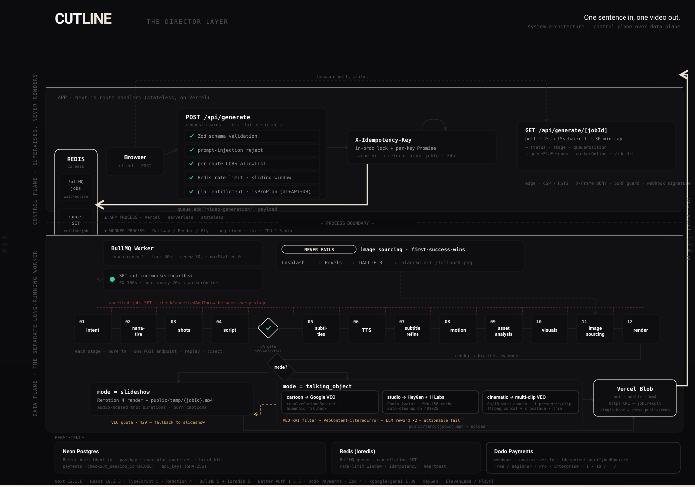

<p align="center">
  
</p>

<p align="center">
  <a href="https://cutline.cloud"></a>&nbsp;
  &nbsp;
  &nbsp;
  &nbsp;
  &nbsp;
  &nbsp;
  
</p>

<p align="center">
  <b>One sentence in, one finished MP4 out</b> - directed by a 12-stage pipeline, not a template engine.<br />
  <a href="https://cutline.cloud"><b>cutline.cloud</b></a> &nbsp;·&nbsp;</a>
</p>

---

## The problem

Short-form video has eaten attention, but the production loop has not compressed. Script, storyboard, b-roll, cut, caption, render - every step has a tool, the assembly is still manual, and by the time the idea is on screen it has aged. The "AI video" category mostly automates the cut, not the editorial work that decides what to cut to.

The naïve AI version - "type what you want, we'll generate a video" - collapses into template fill-ins. Same Ken Burns pan over the same Unsplash photo, same kinetic-type intro, same captions. The output is generic because the system is generic: it picked a layout, not a narrative. CUTLINE takes the opposite bet.

---

## Thesis

### Director layer, not template engine

The pipeline commits to editorial decisions before it touches a frame. From one sentence it infers audience, goal, tone, complexity, and duration; plans a 3-5 beat narrative arc; breaks that into 8-12 shots with per-shot purpose, motion hint, and text density; writes the script aligned to shot boundaries; sources or generates the imagery; composes the MP4. The user does not pick a template, voice, or layout. The system makes those calls. The product is "describe, receive," not "configure, render."

### One sentence in, no creative knobs

Optional brand kit and uploaded assets enrich the pipeline; they do not steer it. A user with a coffee brand can upload their logo + product photos, drop in two hex colors, set `banned_phrases` and `required_phrases` on a `brand_kits` row - the director still chooses the shot list and the cuts. Knobs would dilute the thesis.

### Pipeline over agent

Twelve stages, each a pure function over the previous stage's output. Deterministic stage boundaries beat agent loops for debugging, retries, and per-stage cost control - full stop. When a render looks wrong, you bisect by stage. When a provider regresses, you swap one module. When token spend spikes, you isolate the stage and tighten its prompt. An agent loop hides all three.

### Worker separate from app

Rendering is CPU-heavy. A single render attempt is allowed up to 600 s (`RENDER_TIMEOUT_MS`) and is retried up to 3 times, so worst-case wall clock is far longer than a typical run. Serverless functions time out, and even when they don't, billing-by-execution is the wrong shape for long jobs. The Next.js app handles UI + API + job enqueue; a separate BullMQ worker pipelines and renders. This split is load-bearing for the deploy story: app on Vercel, worker on a long-running host (Railway / Render / Fly), same Redis.

---

## Architecture

<p align="center">
  
</p>

The diagram is the system, not a sketch of it: a **control plane** (the stateless
Next.js app on Vercel - validation, entitlement, idempotency, status polling) sits
over a **data plane** (a separate, long-running BullMQ worker on Railway/Render/Fly),
with **Redis** as the coordination backbone both planes wire into. The job crosses
exactly one process boundary - the queue.

```
Browser
  │ POST /api/generate
  ▼
Next.js API ──► BullMQ + Redis ──► Worker (npm run worker)
  ▲                                   │
  │ GET /api/generate/[jobId]         ▼
  │ (2s → 15s backoff, 30min cap)   12-stage pipeline
  │                                   │
  │                                   ▼
  └─────────── Vercel Blob (https URL)   ◄── worker renders to public/temp,
                                              then uploads the final MP4
```

In the split deploy the worker's `public/temp` is not reachable from the Vercel
app, so the finished MP4 is uploaded to **Vercel Blob** and the job result stores
the public https URL. Set `BLOB_READ_WRITE_TOKEN` on **both** services. With the
token unset (single-host/local dev) the worker serves from `public/temp` directly.

**The 12 stages, in order:** intent → narrative → shots → script → subtitles → TTS → subtitle refine → motion → asset analysis → visuals → image sourcing → render.

**The talking-character branch.** When `mode === "talking_object"` the renderer detours through one of three providers depending on `talkingObjectStyle` + `talkingRealMode`: cartoon goes through Google VEO with an LLM-resolved subject (humanoid fallback for abstract topics); studio framing goes through HeyGen + ElevenLabs; cinematic mode produces multi-clip VEO with a documentary-style different-presenter-per-chunk constraint, ffmpeg concat with crossfade, per-chunk silence trim.

**Cancellation is a Redis SET.** The per-stage POST endpoints (`/api/intent`, `/api/shots`, `/api/script`, `/api/images/source`, `/api/render`, etc.) were removed - they were unauthenticated, unmetered, and their only caller was a debug page that no longer exists. Stage bisection now happens by reading `render_events` rather than by replaying a stage over HTTP. Cancellation is a Redis SET (`cutline:job:cancelled`) read between every stage; on hit the worker throws and the shared cleanup path runs.

---

## Why this is hard

- **Three talking-character modes, three different failure semantics.** Cartoon and cinematic both call Google VEO via `@google/genai`; studio framing calls HeyGen. VEO's RAI filter blocks the generated audio for a spoken line, detected structurally via the SDK's `raiMediaFilteredCount` rather than by string-matching an error message. The block is *not* deterministic - the same prompt can clear on a second attempt - so the chunk loop spends three separate budgets in order: one identical-prompt reroll (`VEO_FILTER_REROLLS = 1`), then up to two LLM reword passes (`VEO_SAFETY_REWORDS = 2`) that vary the *narration* while keeping the *visual* prompt intact. The orchestrator throws a distinct `VeoContentFilteredError` and the retry classifier marks it non-retryable so the generic wrapper doesn't re-fire it. The reworded chunk text is threaded through to caption burn (`finalChunkTexts`) so audio and captions stay synced. When a chunk exhausts all three budgets it is **dropped, not fatal**: the run continues, the finished video is shorter, and the user is told so. The job only fails if *every* chunk is blocked.

- **HeyGen Photo Avatar quota under at-least-once submissions.** Lower-tier HeyGen accounts cap stored Photo Avatars at 3. The upload path keys a SHA-256 cache (`heygenPhotoCache.ts`) on image bytes so identical inputs short-circuit. On `code:401028` (quota full), the orchestrator lists the account, partitions avatars into *orphans* (HeyGen has them, our cache doesn't) vs *cached*, and bulk-deletes orphans oldest-first in parallel batches (concurrency 10, cap 10,000) with LRU eviction over cached as backup. A standalone CLI (`scripts/cleanup-heygen-avatars.ts`) covers one-shot recovery on heavily cluttered accounts.

- **Idempotency without a job-state table.** `X-Idempotency-Key` paired with an in-process `Map` and a per-key `Promise` lock (`withIdempotencyLock`) serializes concurrent submissions with the same key and returns the original `{ jobId }`; 24h retention, configurable. In-memory by design - BullMQ already owns job lifecycle and duplicating that into Postgres creates two sources of truth.

- **12-stage cancellation across a long-running async pipeline.** Cancel writes a Redis SET; every stage reads it before starting work. On hit the worker throws and the same cleanup path runs as on success or failure (`cleanupJobArtifacts`). Cancellation is eventual, not preemptive - latency-to-cancel is bounded by the current stage's duration, not the job's. That's the right shape for a pipeline where each stage is an external API call you'd rather complete than abandon mid-flight.

- **Plan entitlement enforced at three layers.** Free / Beginner / Professional / Enterprise with caps `1 / 10 / unlimited / unlimited` videos per month (from `src/lib/plans.ts`). Pro-only features (cinematic mode, custom avatars, image uploads, downloads, edits, sharing) are gated by UI (badges + lock states), the API handler (`isProPlan(getUserPlan(userId))` before BullMQ enqueue), and the DB (`user_plan_overrides`, written only by the verified Dodo webhook). A tampered request body can't bypass the handler check; entitlement is set server-side from the signed webhook, never the client.

- **Image sourcing has to never fail *per shot* - but a render of blank plates is not a success.** A pipeline that finishes 11 stages and aborts on shot 7 is a wasted job. Per-shot fallback chain `Unsplash → Pexels → DALL·E 3 → simplified-query retry (same three) → placeholder`, query derived per shot from intent + script via OpenRouter, `shouldRetryForImage` classifier retries 429/5xx and gives up on other 4xx. Every link is wrapped so a link that *throws* at runtime (a sustained 5xx that exhausts `retry()`, an abort, a provider returning junk) is logged and advances to the next link instead of escaping the stage, and the query-derivation call has the same treatment with a locally-derived fallback query. So `sourceImageForShot` is total: it always returns *an* image.

  Two deliberate exceptions keep that from becoming a lie. **Absent config fails fast**: a missing `OPENROUTER_API_KEY` throws `ConfigurationError`, which the link wrapper rethrows rather than absorbs - a deploy fault is not a degraded render, and it would reproduce on every shot. Optional image keys are *not* in this class; `PEXELS_API_KEY` / `OPENAI_API_KEY` / `UNSPLASH_ACCESS_KEY` absent means that provider returns null and the chain moves on, by design. **And a placeholder floor**: after the chain runs for all shots, `sourceImages` counts how many ended on the placeholder and fails the stage when that fraction exceeds `IMAGE_PLACEHOLDER_MAX_RATIO` (default `0.5`). One filler frame in a ten-shot video still beats a failed render; six of ten does not. The count lands in stage telemetry either way, so a single fallback is visible to an operator without failing anything.

---

## Design decisions & tradeoffs

**Decision: pipeline, not LLM agent.**
Why: deterministic stage boundaries beat agent loops for debugging, retries, and per-stage cost control.
Tradeoff: less emergent behaviour, more handcrafted prompts per stage. We chose visibility over magic.

**Decision: worker on a long-running host, not serverless.**
Why: 1-3 minute renders die in serverless timeouts and per-execution billing is the wrong shape for long jobs.
Tradeoff: deploy is two services (Vercel app + Railway/Render worker) sharing one Redis. Worth it.

**Decision: in-memory idempotency + Redis cancellation, not a job-state Postgres table.**
Why: BullMQ already owns job lifecycle. Duplicating it in Postgres creates two sources of truth and a synchronization bug class.
Tradeoff: the idempotency cache resets on app restart. A duplicate `POST` with the same key within 24h *after* a restart creates a second job. We carry the request ID through logs for support correlation.

**Decision: placeholder image as terminal fallback in image sourcing.**
Why: every shot must have an image. A pipeline that succeeds 99% is operationally worse than a pipeline that finishes with one filler frame.
Tradeoff: a deployment with no image API keys produces watermark-looking output and will churn that user. Logs make it loud; the trade is conscious.

**Decision: `user_plan_overrides` table separate from the Better Auth `user` table.**
Why: entitlement is a thin map keyed by `user_id`; identity is Better Auth's job. Coupling them locks billing to a specific auth provider.
Tradeoff: `getUserPlan(userId)` reads two tables. Trivial query cost in exchange for an auth-provider swap that doesn't touch billing.

---

## Failure modes

- **VEO content-safety block on chunk N.** Detected as `VeoContentFilteredError`. The orchestrator first rerolls the identical prompt once, then runs up to two LLM rewords on that chunk's narration (meaning preserved, wording varied), regenerating the chunk each time and threading the reworded text into caption burn. If the chunk still won't clear, it is **skipped and the run continues** - caption timing and the crossfade total are recomputed from the chunks that actually rendered, and the response carries "N segment(s) couldn't clear the content-safety filter and were skipped, so your video is a little shorter than Xs." Only if *no* chunk survives does the job fail, with: "Every segment was blocked by the content-safety filter, so no video could be assembled. Try changing your topic or wording, switch to Cartoon style, or use Slideshow mode."

- **HeyGen `401028` Photo Avatar quota full.** Bulk auto-cleanup partitions orphans vs cached, deletes oldest orphans in parallel batches, then retries the upload once. If retry still hits 401028, the *user-facing* error is generic ("talking-character videos are temporarily unavailable; try Slideshow mode"); the *operator* log carries the technical detail and points at the CLI cleanup script. End users never see internal URLs or script paths.

- **Image provider 5xx / 429.** `shouldRetryForImage` retries transient failures on a fixed backoff table (`[1000, 2000]`, clamped to the last entry - not a computed exponential). If the provider is still failing when the budget runs out, `retry()` throws; the link wrapper catches it, logs `advancing to next link`, and the chain continues Unsplash → Pexels → DALL·E → simplified retry → placeholder. One provider down: render completes, `placeholderCount` stays at 0. *Every* provider down: each shot lands on the placeholder, the floor trips, and the job fails with `ImageFallbackFloorError` naming the count and the limit - classified non-retryable, so the stage is not re-run and re-billed for a failure that would reproduce exactly.

- **Worker process killed mid-render.** Per-job temp dir is deleted on success, failure, and cancel via one shared cleanup path. An orphan-sweep job (`CLEANUP_EXPIRED_HOURS`) can run every 60 minutes as a backstop for dirs from crashed processes, but it is **off by default** - it only schedules when `CLEANUP_EXPIRED_HOURS` is set to a positive number. Final MP4 retention is separate (`VIDEO_RETENTION_HOURS`, default 24h).

- **Dodo webhook replay or retries.** Dodo delivers at-least-once; the webhook claims each event in `processed_webhook_events` atomically (`INSERT … ON CONFLICT DO NOTHING RETURNING`) before granting, so duplicates no-op. Double-grant is structurally impossible.

---

## Security model

- **Browser hardening (`next.config.ts`).** CSP with `frame-ancestors 'none'`, `object-src 'none'`, `base-uri 'self'`, `form-action 'self'`, `upgrade-insecure-requests`. HSTS `max-age=63072000; includeSubDomains; preload`. `X-Frame-Options: DENY`, `X-Content-Type-Options: nosniff`, `Referrer-Policy: strict-origin-when-cross-origin`, `X-Permitted-Cross-Domain-Policies: none`. Applied to every response.

- **API keys (`api_keys` table).** Format `clk_<48 hex>` generated from `crypto.randomBytes(24)`. Stored as **SHA-256 of the full key**, with a 16-char prefix kept as the indexed lookup column. Plaintext is returned exactly once at creation; the DB never has it.

- **Dodo webhook signature verification.** `@dodopayments/nextjs` `Webhooks({ webhookKey })` verifies the Standard-Webhooks signature before any handler runs. Missing or invalid signature → 401.

- **SSRF guard on `callbackUrl`.** Validates scheme (`http` / `https` only), rejects `localhost` / `127.0.0.1` in production unless `ALLOW_LOCALHOST_WEBHOOK=true` is explicitly set. Fire-and-forget, 5-second timeout, no retries. Receivers must be idempotent.

- **Plan entitlement.** Gated at UI, API handler (before BullMQ enqueue), and DB (`user_plan_overrides`, written only by the verified Dodo webhook). Pro-only features cannot be reached by tampering with the request body alone.

- **Prompt-injection rejection.** `validateGenerateInput` rejects topics matching the injection-pattern set with a field-level `VALIDATION_FAILED`.

- **Rate limiting.** Redis-backed **fixed window** keyed on client IP (`rate-limiter-flexible`), per-route caps via env. Seven limit types, not three: generate (5/h), generateDaily (50/day), apiKeyGenerate (120/h), upload (20/h), status (60/min), contact (5/h), general (100/min). On a Redis store fault the limiter **fails open** and logs, rather than 429-ing every route.

- **CORS.** Per-route allowlist via `CORS_ORIGIN` / `CORS_ORIGINS`. Admin and telemetry routes are excluded from CORS by design.

---

## Stack

Next 16.1.6 · React 19.2.3 · TypeScript 5 · Remotion 4.0.414 · BullMQ 5 + ioredis 5 · Better Auth 1.5.5 (+ passkey) on Neon Postgres · Dodo Payments · Zod 4 · Google VEO via `@google/genai` 1.39 · HeyGen · ElevenLabs / PlayHT · Vitest 2.

Worker runs uncompiled via `tsx`. React Compiler enabled in production.

---

## What's intentionally NOT built yet

- **Multi-seat / team accounts** - single-tenant. Multi-seat when a multi-seat customer is on the line to design against.
- **Job approvals + comments review flow** - `job_approvals` and `job_comments` tables scaffolded; review/collaboration flow deferred until usage shape demands it.
- **Worker horizontal scaling** - single worker process. The BullMQ side already supports N workers; finished MP4s now land in Vercel Blob (durable, cross-host), so multiple workers no longer fight over one local `public/temp`.
- **Public template marketplace** - explicit non-goal. "No templates" is the thesis, not a stopgap.

**Followups (real, not features):** CAPTCHA libraries (`@hcaptcha/react-hcaptcha`, `@captchafox/react`, `@marsidev/react-turnstile`) are in `dependencies` with no production wiring. Audit and consolidate to one provider before sign-in goes public.

---

## Run locally

```bash
git clone https://github.com/parbhatkapila4/Cutline.git
cd Cutline
npm install
cp .env.example .env.local
```

**Required env:** `REDIS_URL`, `OPENROUTER_API_KEY`, `ELEVENLABS_API_KEY`.
**Recommended:** at least one of `UNSPLASH_ACCESS_KEY`, `PEXELS_API_KEY`, `OPENAI_API_KEY` (DALL·E).
**For auth + billing:** `DATABASE_URL` (Neon), `BETTER_AUTH_SECRET`, `DODO_PAYMENTS_API_KEY`, `DODO_PAYMENTS_WEBHOOK_KEY`, `DODO_PAYMENTS_RETURN_URL`, `GOOGLE_CLIENT_ID` / `GOOGLE_CLIENT_SECRET`.

**Schema bootstrap** (only when `DATABASE_URL` is set): paste `src/lib/db/schema.sql` into the Neon SQL Editor and run it; then `npm run auth:migrate` for Better Auth tables.

Two terminals:

```bash
npx next dev       # terminal 1, port 3000
npm run worker     # terminal 2, same .env.local
```

Without the worker, jobs sit in `pending` forever **in production**. Outside production (or with `CUTLINE_AUTOSTART_WORKER=true`) `POST /api/generate` starts an in-process BullMQ worker, which is why `next dev` alone can still render.

Further reading, by topic: [`docs/DEPLOY_WORKER.md`](docs/DEPLOY_WORKER.md) (worker deploy + the env checklist),
[`docs/IMAGE_API_KEYS.md`](docs/IMAGE_API_KEYS.md) (image provider keys),
[`docs/BETTER_AUTH_SETUP.md`](docs/BETTER_AUTH_SETUP.md) and [`docs/AUTH_AND_BILLING.md`](docs/AUTH_AND_BILLING.md) (auth + billing),
[`docs/PRODUCTION_CHECKLIST.md`](docs/PRODUCTION_CHECKLIST.md), and [`ARCHITECTURE.md`](ARCHITECTURE.md).
The HTTP API spec and error codes are served by the app itself at `/docs`.

---

## About

Built by **Parbhat Kapila** - full-stack engineer focused on production AI systems. Currently building Sentinel (CRM revenue intelligence), VectorMail (AI email client), Visura, and RepoDocs (codebase RAG). Portfolio: [parbhat.dev](https://parbhat.dev).
